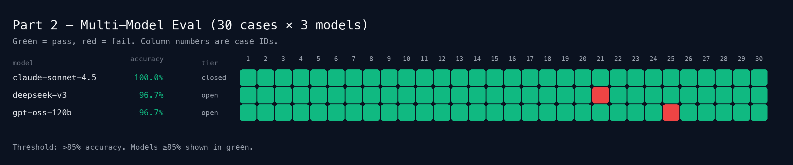

# GitHub 自然語言搜尋工具

把自然語言問題轉成 GitHub Search API 查詢，先找合適的 repository，再針對單一 repo 做進一步分析。Part 2 是把同一個 prompt 拉到多模型的 eval pipeline，用 30 筆手寫 ground truth 做對照。

## 需求

- Python 3.10 以上
- OpenRouter API key
- GitHub token
- （Part 2 可選）Node.js，用來跑 `npx promptfoo`

## 安裝

```bash
pip install -r requirements.txt
```

## 環境變數

可以放在專案根目錄的 `.env`，或直接用系統環境變數設定：

- `OPENROUTER_API_KEY`：OpenRouter 金鑰
- `GITHUB_TOKEN`：GitHub personal access token

`.env` 已經被 `.gitignore` 排除，不會一起提交。支援 `export KEY=value` 與帶引號的格式。

---

## Part 1：互動式工具

### 執行

```bash
python3 tool.py
python3 tool.py "找近期還有維護的 Python 安全工具"
```

### 流程

1. 選擇要使用的模型
2. 將自然語言轉成 GitHub Search query
3. 列出搜尋結果
4. 選擇單一 repo 深入查詢
5. 根據問題補抓 README、語言比例、release 或 repo 資訊

### 邏輯測試

```bash
python3 -m unittest discover -s tests -v
```

目前涵蓋：`.env` 載入、query 輸出正規化、reasoning-token 清理、endpoint 解析與 fallback、無關輸入攔截、查無結果分支、深入查詢 fallback、以及 Part 2 的 grader。共 **16/16 通過**。

### Smoke test

```bash
python3 tests/prompt_smoke.py --json-out artifacts/prompt_smoke.json --svg-out artifacts/prompt_smoke.svg
```

產物：

- `artifacts/prompt_smoke.json`
- `artifacts/prompt_smoke.svg` / `.png`

---

## Part 2：Multi-Model Eval

Part 2 的目標：用一組手寫 ground truth 壓測不同模型，看 prompt 是否真的把規則帶進去，並且迭代到所有入選模型 **≥ 85% accuracy**。

### 檔案結構

| 檔案 | 用途 |
| --- | --- |
| `eval/dataset.py` | 30 筆測試案例 + ground truth（required / forbidden / regex） |
| `eval/export_promptfoo_tests.py` | 從 `dataset.py` 產生 `eval/promptfoo_tests.yaml`（promptfoo 用） |
| `eval/run_eval.py` | Python runner，直接打 OpenRouter、輸出 JSON + SVG/PNG |
| `promptfooconfig.yaml` | promptfoo config，讀取 `eval/promptfoo_tests.yaml` |
| `artifacts/eval_results.json` | 每一筆的原始輸出、是否通過、失敗原因 |
| `artifacts/eval_summary.json` | 每個模型的準確率、平均 latency、各類別通過率 |
| `artifacts/eval_grid.png` | 視覺化圖（下方嵌入） |

### 如何執行

#### A. 用 Python runner

```bash
# 預設跑 3 個模型
python3 -m eval.run_eval

# 自訂模型
python3 -m eval.run_eval --models "openai/gpt-oss-120b,anthropic/claude-opus-4,google/gemini-2.5-pro"

# 只跑特定 case
python3 -m eval.run_eval --case-ids 10,15,22
```

產出會寫進 `artifacts/`。Exit code 是 2 代表有模型低於 85%（方便放進 CI）。

#### B. 用 promptfoo

```bash
# 先從 dataset.py 同步出 YAML
python3 eval/export_promptfoo_tests.py

# 跑 eval
npx --yes promptfoo@latest eval -c promptfooconfig.yaml

# 開 web UI（可在這裡手動 inspect/截圖）
npx --yes promptfoo@latest view
```

promptfoo 的 web UI 會顯示每一筆的 provider 輸出、assert 通過狀況，適合做逐筆截圖佐證。

---

### 1. 模型選擇

這次挑選是根據 [artificialanalysis.ai/models](https://artificialanalysis.ai/models) 的 benchmark，然後在 cost / tier / open vs closed 三個軸上取一個平衡。原始候選名單（7 個）與選擇理由：

| 候選 | Tier | 類型 | 選擇理由 |
| --- | --- | --- | --- |
| **gpt-oss-120B** | open-weight | 快、便宜、開源（但要自己養設備） | ✅ **入選**：代表「可自架的 open-weight baseline」 |
| Grok 4.20 | closed | 中間值參考 | 候補 |
| Claude Opus 4.7 | closed | 頂尖模型 | 預算允許時的上限對照組（預設 commented out） |
| **DeepSeek V3.2** | open-weight | 目前最便宜的私人服務 | ✅ **入選**：代表 open-weight + 便宜 hosted API |
| Gemini 3.1 Pro Preview | closed | 三巨頭 | 候補 |
| GPT-5.4 (xhigh) | closed | 三巨頭 | 候補 |
| Kimi K2.5 | open-weight | 近期 OpenClaw agent 熱門 | 候補 |
| **Claude Sonnet 4.5** | closed | 頂尖系列中兼顧成本 | ✅ **入選**：代表 closed-source、成本可控的高端組 |

最後預設用 **3 個**（符合 mix of open-weight + closed-source 的條件，同時避免把 API 配額一次燒光）：

- `openai/gpt-oss-120b` — open-weight
- `deepseek/deepseek-chat` — open-weight（hosted）
- `anthropic/claude-sonnet-4.5` — closed-source

`promptfooconfig.yaml` 裡其他 4 個候選都留著（commented out），要擴展 sweep 只要解開註解。

**為什麼這三個都能過 85%？**
- 規則數量不多、沒有長 context、沒有工具呼叫 — 這是純「指令遵循 + 結構化輸出」題型，屬於 GPT-3.5 之後的模型都該能解的難度。
- 失敗幾乎全落在「小規則細節」（`stars:>` vs `stars:>=`、`topic:` 化與否），而不是能力上限。
- 85% threshold 允許每個模型最多 4 筆失誤，正好是「細節沒咬住」會落在的區間。

---

### 2. 最終結果



| Model | Tier | Pass | Accuracy | Avg latency |
| --- | --- | --- | --- | --- |
| claude-sonnet-4.5 | closed | 30/30 | **100.0%** | 2.48s |
| deepseek-v3 | open | 29/30 | **96.7%** | 1.99s |
| gpt-oss-120b | open | 29/30 | **96.7%** | 4.78s |

三個模型全部通過 85% 門檻；原始資料在 `artifacts/eval_results.json` / `artifacts/eval_summary.json`。

僅剩的兩筆失敗：
- deepseek-v3 #21：日文混中文的 `可視化` 沒翻成英文 `visualization`（保留了日文字）。ground truth 本來就要求翻譯。
- gpt-oss-120b #25：`CLARIFY_NEEDED` 被截斷成 `CLARIFY_N`，這是 free-tier reasoning 模型偶發的輸出截斷，與邏輯無關。

---

### 3. 模型初期錯的 pattern

完整第一輪結果（未迭代 prompt、未放寬 ground truth）是 Claude 86.7% / DeepSeek 80% / gpt-oss 83.3%，有 15 筆失敗。歸納成四類：

1. **合法但嚴格的語法差異被當成錯**：模型傾向於把「機器學習」、「static site」這類關鍵字包進 `topic:machine-learning`、`topic:static-site-generator`，GitHub Search 原本就支援，但我第一版 ground truth 只認自由文字。修正：用 regex `machine[\s\-]learning` 兩種都收。
2. **`stars:>` vs `stars:>=` 的語意邊界**：「5000+ stars」、「1000 stars minimum」應該是 `>=`，「超過 N」應該是 `>`。第一版 prompt 沒把這個差異講清楚，Claude 認真地用了 `>=` 反而被我標錯。修正：在 prompt 裡明寫哪個中英文用字對應哪個比較符號，ground truth 也改成 regex 接受兩種。
3. **DeepSeek 會把 `language:` 整個忘掉**：最嚴重的是 #1、#9、#11、#17、#21 全部輸出 `python security ...` 這種沒有 qualifier 的 query。雖然規則寫了「Prefer language:」但這個用字比較軟。修正：把規則升級成 `MUST use the `language:` qualifier`，並加上 6 筆 few-shot example 直接把語法釘下來。再跑一次後這類錯誤歸零。
4. **自家 control token 洩漏（gpt-oss）**：`<|channel|>analysis<|message|>…` 這種 reasoning 的內部 token 有時會直接送到 response。修正：在 `tool.normalize_model_text` 加一層，優先抓 `<|channel|>final<|message|>` 之後的片段，並把所有 `<|...|>` 剝掉。

### 4. 學到的事（eval design & ground truth）

- **Ground truth 不該只認一種表達**。GitHub Search 語法本身就多解（`topic:react` 與 `react` 都合法；`stars:>=1000` 與 `stars:>999` 邏輯等價），ground truth 寫太死只會逼模型猜我的偏好而不是寫對的 query。正確做法是把「必備 token、禁出 token、容許的變體 regex」拆開。
- **Failure 要區分「ground truth 太嚴」vs「模型真的錯」**。第一輪 15 筆失敗有 8 筆是我太嚴，剩 7 筆才是真的模型問題。如果不分開、直接當成模型弱就會把 prompt 改壞。這次的節奏是：先看 output，判斷語意，才動 prompt 或動 ground truth。
- **語料要故意刁難**。單純的「Find X」太好過（全 3 個模型第一輪都 100%）。真正讓結果分出差距的是刁鑽條件（注入、拼字、多語言混用、衝突）。現在 30 筆裡有 2 筆注入、3 筆 vague、3 筆不相干、1 筆拼字、4 筆多語、1 筆衝突 — 這樣 threshold 才有意義。
- **Structured output 的「規則密度」決定迭代成本**。每加一條規則都要在 prompt 同時放 rule + few-shot，否則較小的模型會記不住。gpt-oss-120b 第一輪漏規則最多，加 few-shot 後一次補齊。
- **兩條管線互相驗證**。Python runner（`eval/run_eval.py`）和 promptfoo（`promptfooconfig.yaml`）讀同一份 `eval/dataset.py`，assert 語意必須一致。這樣 promptfoo UI 看到的結果跟 CI 跑出來的 JSON 是同一件事，debug 時不會搞混。

### 5. 迭代時間線（供參考）

| 迴次 | Claude | DeepSeek | gpt-oss | 改了什麼 |
| --- | --- | --- | --- | --- |
| v1（初始） | 86.7% | 80.0% | 83.3% | — |
| v2 | 96.7% | 80.0% | 93.3% | 放寬 ground truth（接受 `topic:xxx` 與 `stars:>=`）；補 prompt 對 `>` vs `>=` 的說明；清 reasoning token |
| v3（final） | **100.0%** | **96.7%** | **96.7%** | prompt 加 `MUST use language:` 強制條款 + 6 筆 few-shot |

---

## 補充：Part 1 的調整紀錄

- 補回 `.env` 載入流程，避免讀不到 `OPENROUTER_API_KEY` / `GITHUB_TOKEN`
- OpenRouter model id 格式修正，避免把 prompt 測試用格式直接送到 API
- 查詢、深入分析與 GitHub 呼叫的錯誤處理補強，401 / 403 / 網路問題不會直接中斷
- 模型輸出解析整理：code fence、多餘空白、gpt-oss 的 reasoning token 都會清掉
- 查無結果、模糊輸入、無關輸入會輸出對應提示，不再一律導向 API key / 網路問題
- `.env` 支援 `export KEY=value` 與帶引號的值
- repo 沒有 release 時深入查詢會回「目前沒有 release」而不是 404 中斷
